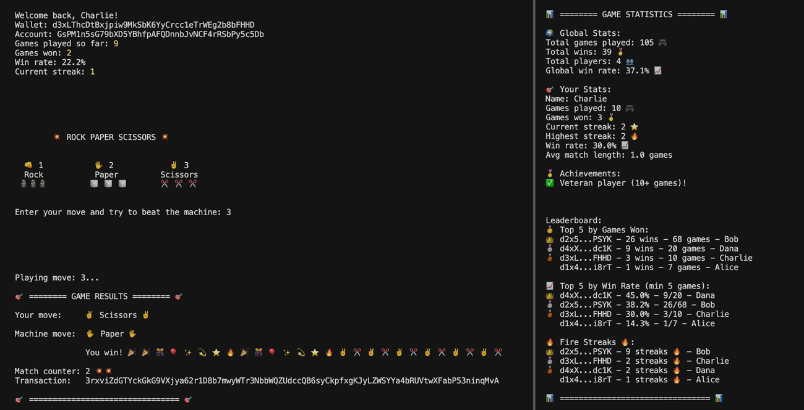

# ✊🖐✌️ Rock Paper Scissors on Solana

A lightning-fast, on-chain Rock Paper Scissors game built for Solana devnet!

---

## How it Looks



---

## How it Works

```
┌──────────────────┐      ┌────────────────────────┐      ┌────────────────────┐
    👤 PLAYER                  🔐 RPS PROGRAM                 📊 RPS PDA

 • Pick move         ◄──►    • Verifies moves        ◄──►    • Game state
 • Submit tx                 • Updates stats                 • Player stats
 • Wait for result           • Determines winner             • Winner history
└──────────────────┘      └────────────────────────┘      └────────────────────┘
                                      │
                                      │
                          ┌────────────────────────┐
                              👤 PLAYER PDA
                             • Individual stats
                             • Wins/Losses
                             • Streaks
                          └────────────────────────┘
```

---

## PDAs

The game uses Program Derived Addresses (PDAs) to securely store game state and player information on-chain:

- **Player PDA**: One PDA per player to store individual statistics (wins, losses, streaks)
- **Game PDA**: One PDA per game session to store current game state and moves
- **Global Stats PDA**: One PDA for global leaderboard and overall game statistics

---

## Features

- **On-Chain Game Logic**: Every move is verified and stored on Solana devnet
- **Player Statistics**: Track your wins, losses, and streaks permanently on-chain
- **Global Leaderboard**: Compete with players worldwide on devnet
- **No Authority Required**: Just your devnet wallet—no admin, no gatekeepers
- **Simple Setup**: Clone, configure wallet, play. That's it!

---

## Play the Game!

### Requirements

- [Node.js](https://nodejs.org/) (v16+)
- [Yarn](https://yarnpkg.com/)
- [Solana CLI](https://docs.solana.com/cli/install-solana-cli-tools)
- [Anchor CLI](https://book.anchor-lang.com/getting-started/installation.html)

### Quick Start

1. **Clone the repo**

   ```bash
   git clone https://github.com/lostconversation/sol-ropasci.git
   cd sol-ropasci
   ```

2. **Install dependencies**

   ```bash
   yarn install
   ```

3. **Configure your wallet**

   Edit `config.json` and add your Solana devnet wallet path:

   ```json
   {
     "player_wallet": "YOUR_WALLET.json"
   }
   ```

   > **Tip:** Use `solana-keygen new --outfile ~/.config/solana/devnet.json` if you need a wallet.

4. **Play!**
   ```bash
   yarn play
   ```

---

## 🌐 Network

- **Devnet Only**: This game is for Solana devnet.
